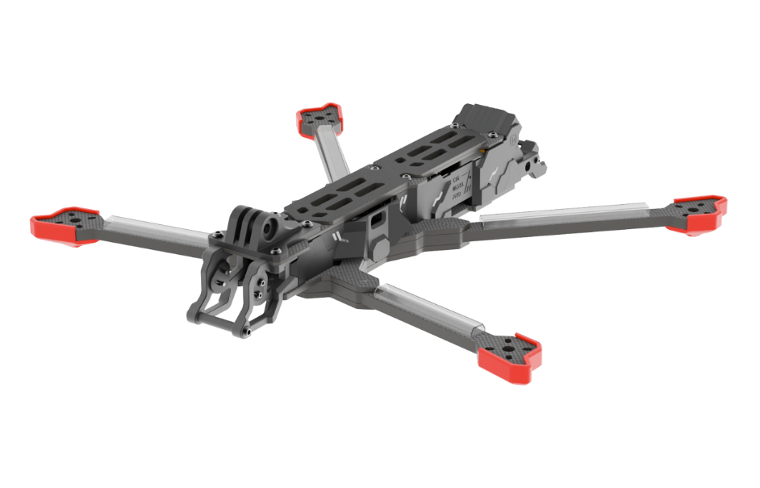
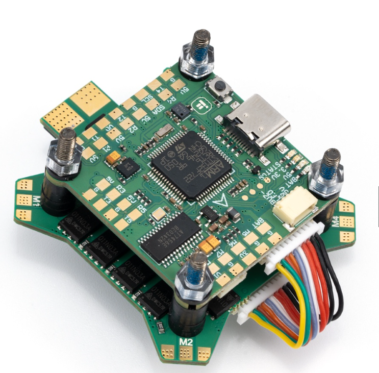
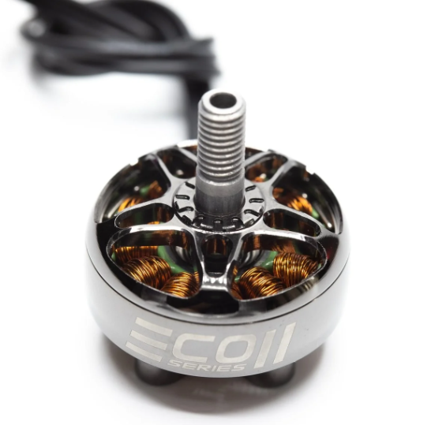
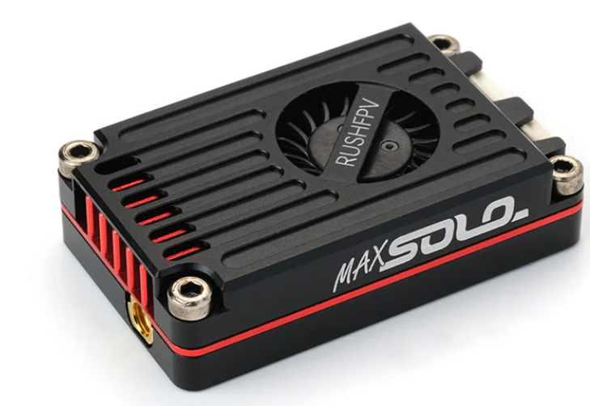
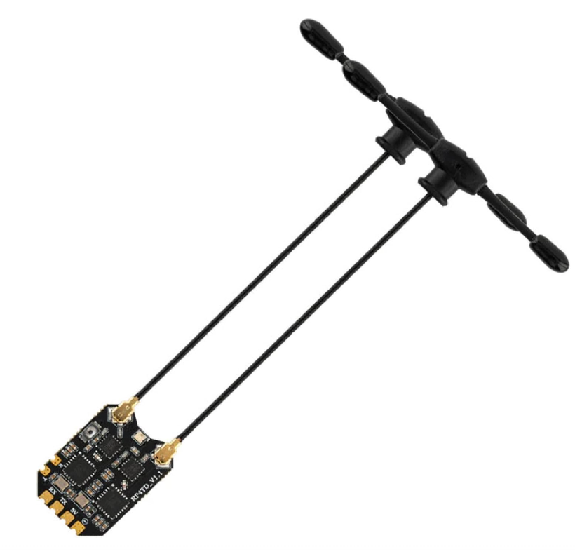
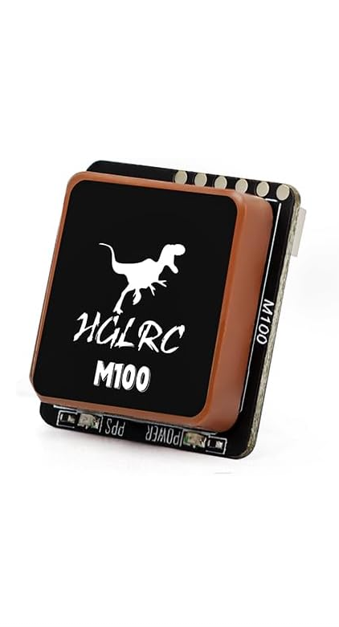
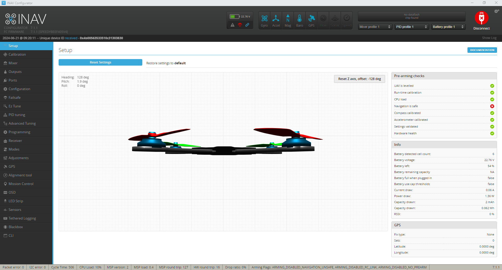
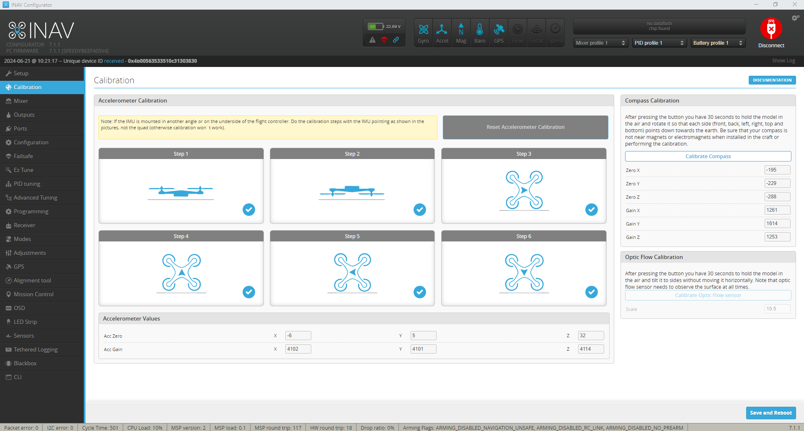
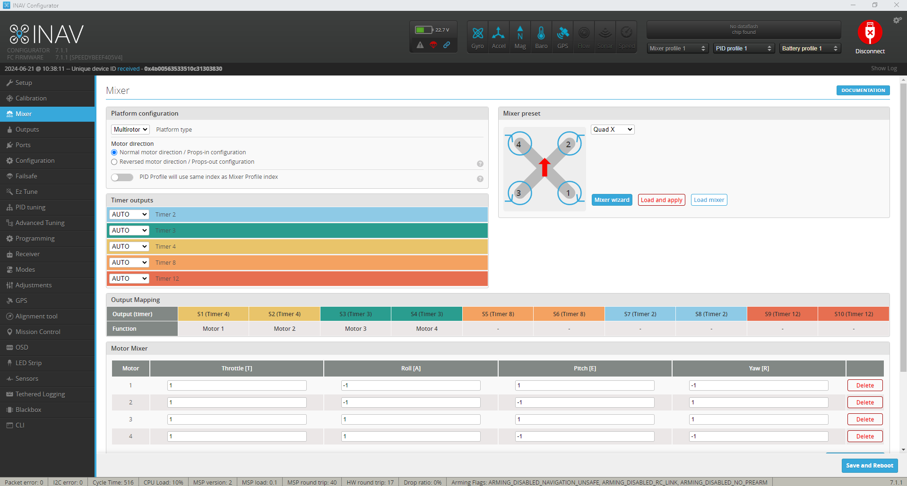

ww# Table of Contents

- [How to Build an FPV 7" Drone (Analog)](#how-to-build-an-fpv-7-drone-analog)
- [Part Lists](#part-lists)
  - [Essential Tools and Supplies](#essential-tools-and-supplies)
  - [iFlight Chimera 7 pro V2 (Frame)](#iflight-chimera-7-pro-v2-frame)
  - [IFlight BLITZ F7 (Stack)](#iflight-blitz-f7-stack)
  - [Emax ECO II (Motors)](#emax-eco-ii-motors)
  - [RUSH TANK MAX SOLO (FPV Setup)](#rush-tank-max-solo-fpv-setup)
  - [RadioMaster RP4TD ELRS Diversity FPV Receiver](#radiomaster-rp4td-elrs-diversity-fpv-receiver)
  - [HGLRC M100-5883 GPS Module](#hglrc-m100-5883-gps-module)
- [Steps of Building FPV Drone](#steps-of-building-fpv-drone)
  - [Frame Assembly](#frame-assembly)
  - [Wiring Diagram](#wiring-diagram)
  - [Motors Wiring](#motors-wiring)
- [What’s iNav?](#whats-inav)
- [Why I use iNav on my Quads?](#why-i-use-inav-on-my-quads)
- [Download iNav Configurator](#download-inav-configurator)
- [Checking iNav Compatibility](#checking-inav-compatibility)
- [Flashing  INAV](#flashing--inav)
- [Default Values](#default-values)
- [Setup Tab](#setup-tab)
  - [Sensors](#sensors)
  - [Pre-arming Checks](#pre-arming-checks)
  - [Board Orientation](#board-orientation)
- [Calibration Tab](#calibration-tab)
- [Mixer Tab](#mixer-tab)
- [Outputs Tab](#outputs-tab)

# How to Build an FPV 7" Drone (Analog)

In this tutorial, I’ll walk you through the process of building an FPV drone from scratch, providing detailed guidance for analogue FPV systems. We’ll cover everything from selecting the right components, to wiring and assembly, and even share insider tips and tricks to ensure you have a reliable and enjoyable FPV drone experience. This is about 653.3 grams of drone i built.

# Part Lists
In this tutorial, we’ll be using the following parts to guide you through the FPV drone building process

| Component       |                                                  | Links                 |     price      |
|-----------------|--------------------------------------------------|-----------------------|----------------|
| Frame           |iFlight Chimera 7 pro V2                          |https://rb.gy/kc739k   | ₱6,814 |
| FC & ESC (stack)|IFlight BLITZ F7 Stack                            |https://rb.gy/9lx2at   | ₱6,267 |
| Motors          |Emax ECO II 2807 6S 1300KV (4pcs)                 |https://rb.gy/76ggqy   | ₱939   | 
| Propellers      |7040 FPV Drone 7 inch 3-Blade Propellers          |https://rb.gy/7qmuit   | ₱498   |
| Battery         |RC LiPo Battery 6S 22.2V 35c XT60 plug            |https://rb.gy/9fjomg   | ₱2,925 |
| GPS Module      |HGLRC M100-5883 GPS Module                        |https://cl.gy/cNaCB    | ₱791   |
| Receiver        |RadioMaster RP4TD ELRS Diversity FPV Receiver     |https://cl.gy/ZPOvG    | ₱1736.68 |
| Transmitter     |RADIOMASTER ELRS Radio Controller TX12 MK II      |https://cl.gy/ebIRj    | ₱11,317|
| Goggles         |Skyzone Cobra X Goggles                           |https://cl.gy/SXWoz    | ₱15,000|
| VTX             |RUSH TANK MAX SOLO 5.8GHz 2.5W High Power 48CH VTX|https://cl.gy/lCwDR    | ₱3,260 |
| Antenna         |Rush Cherry II FPV 5.8G                           |https://cl.gy/EqXYX    | ₱960   |
| Camera          |Foxeer Razer                                      |https://cl.gy/oXxin    | ₱1,350 |
| Gimbal          |Camera Gimba                                      |https://cl.gy/YGFNp    | ₱143   |
| Filter          |IFlight Anti Spark Filter with XT60E-M            |https://cl.gy/Xpwqu    | ₱1,310 |
| Servo           |180 Degree  Micro Servo Motor                     |https://cl.gy/HoHzu    | ₱81    |

**Total Estimated Cost:** ₱53,391.68 \(approx\.\) 
**Notes:**
* Prices are based on estimates and may vary depending on the retailer.
* Additional parts and tools may be required for assembly and flight operation (e.g., soldering iron, battery charger).

## Essential Tools and Supplies
To successfully build your FPV drone, you’ll need the following tools and supplies. Some of these items may already be in your toolkit, while others can be easily found online or at your local hardware store:
- Soldering Iron and solder
- Soldering Flux
- A pair of scissors for stripping and cutting wires
- Shrinkable tube to organize wires
- 3M double sided foam tape
-A collection of 2mm wide zip ties (ideally 15cm or longer)

## iFlight Chimera 7 pro V2 (Frame)

The iFlight Chimera7 is a 7.5" longrange frame designed to give maximum stability and flight time during your cinematic shoots.

Fly smooth lines on the waterfront all the way to the Swiss Alps if you want! Made from a super-stiff carbon for minimum resonance and recommended 2806.5 motors for maximum 7.5" prop control.

Fly big batteries top-mounted, or even bigger batteries bottom-mounted, 6 cells recommended or 5 cells for slow cruising. But whatever style you fly, a Lipo or Lion pack will do the job.

## IFlight BLITZ F7 (Stack)

Improved circuit design, better components and lower electrical noise!

DJI HD VTX Connector (Plug-and-Play / No soldering required)

FC indicator LEDs for visual debugging

With LC filter

## Emax ECO II (Motors)

I choose Emax ECO II 2807 6S 1300KV motors, for equipping 7-inch dronew build with Perfect Power and Torque Balance, Extended Flight Times with High Efficiency, efficient, smooth and stable flight performance, and durable motors that will elevate your flying experience.

## RUSH TANK MAX SOLO (FPV Setup)

I choose RUSH TANK MAX SOLO 5.8GHz 2.5W High Power 48CH VTX Video Transmitter with CNC shell for RC FPV Long Range Fixed-wing Drones. Developed for extreme long-range pilots,compact and efficient active cooling design unleashes the full performance of the VTX.

LOCK-ON technology with jitter-free transmit channels and no sweep interference for multi-pilot flights.

Factory power consitency calibration for all channels.

Low noise DC-DC power supply design oor clean screens.  

## RadioMaster RP4TD ELRS Diversity FPV Receiver

Featuring dual-channel 2.4GHz radios, the RP4TD excels in signal sensitivity, signal-to-noise ratio, and overall performance due to its optimized circuit design. The reliable DCDC power supply circuit ensures lower operating temperatures during extended usage. Additionally, the dual TCXO contributes to the utmost frequency stability and makes the RP4TD a leader in its class. The RP4TD features built in WIFI so you can wirelessly upgrade firmware to configure the receiver via the built-in WebUI with your PC or mobile phone.

Suitable for drones and fixed-wing models, the receiver can be installed in virtually any application that requires a serial receiver!

## HGLRC M100-5883 GPS Module

Featuring HGLRC M100-5883 GPS this gps has 10th generation chip which  extremely fast positioning and also quickly identify the direction (Accurate positioning) and has a three mode positioning the GPS + Galileo + BDS and also have a stable signal which carefull modulated ceramic antenna and external expansion PCB and lastly On-board POWER power indicator, PPS positioning indicatorWorking status at a glance.

# Steps of Building FPV Drone

## Frame Assembly

You don`t need to worry about the frame assemble because when you buy a frame for drone it provide manual of how to assemble that frame.

<a href="/img/Chimera7 Pro V2 Frame Assembly Guide.pdf">Download Chimera7 Pro V2 Frame Assembly Guide</a>

## Wiring Diagram
Before proceeding, it’s a good idea to create a wiring diagram on a piece of paper outlining how to connect all the components. If you’re using the components I recommended, here are connection diagrams you can follow.

<a href="/img/BF12083＆BF11520_BLITZ F7 FC Wiring Diagram_20231101 (1).pdf" target="_blank" rel="noopener noreferrer">
  Download Wiring Diagram (PDF)
</a>

## Motors Wiring
I have a pdf that you can see on how to install properly motors in the ESC

<a href="/img/ESC Wiring Diagram.pdf">Download ESC Wiring Diagram</a>

# What’s iNav?
Inav is a flight control software, which was forked from Clean Flight. The software supports both multi-rotors and fixed wings and has good GPS modes like Return to launch (RTH) etc. The software has a mission planner, which allows for setting full autopilot GPS way-point navigation. It supports a variety of Flight controller boards and is actively being developed by the community.

# Why I use iNav on my Quads?
While Betaflight is a popular choice for FPV (First Person View) racing drones, inav offers some distinct advantages that make it a compelling option for certain types of quadcopters, especially those built for long-range or autonomous flight. iNav stands out for its advanced GPS flight modes, far surpassing Betaflight’s capabilities. Not only it supports GPS return-to-home functionalities, but also position hold and autonomous waypoint missions.

# Download iNav Configurator
- Download the latest iNav Configurator here: https://github.com/iNavFlight/inav-configurator/releases

# Checking iNav Compatibility
- Before proceeding, verify if your flight controller is compatible with iNav.
In the iNav Configurator, on the Firmware Flasher page, search for your FC’s firmware target. If it’s listed, congratulations, you can proceed to the next step. If not compatible, consider getting a new FC, such as the Speedybee F405 V4 – an affordable, feature-rich option ideal for an iNav drone build.

 # Flashing  INAV
 - First if you have an existing setup in Betaflight you need to backup your setup before you proceed INAV, Then if you have done backup you setup in BetaFlight.  Select the firmware target for your FC. Note that the Auto-select button may not work if your FC is still running Betaflight.

Enable “Full chip erase” and leave the other options unchecked. 

# Default Values
- After installing iNav, you’ll be prompted to choose a preset that most closely matches your quad, such as 3-inch, 5-inch, or 7-inch quad.

# Setup Tab
- In the first page – Setup, you can view the status of your drone.

## Sensors
At the very top of the iNav Configurator, you’ll see an array of blue icons representing the sensors. These icons light up when the sensors are configured and functioning correctly, and they are not turned on, it means the sensor is not configured or is missing from your setup.

The Gyro and Accel sensors should always be on. If your flight controller (FC) has a barometer, the Baro icon should also light up. Other common sensors for FPV drones include GPS and Mag (magnetometer – compass).

## Pre-arming Checks
On the right-hand panel, you’ll find the Pre-arm checks. All the listed items should display green ticks in order to arm the quad.

If any of these items show a red cross, don’t worry—we will guide you through the setup in this tutorial. For instance, if you have enabled GPS but don’t have a lock, “Navigation is safe” will show a red cross, which is common indoors. Some flight controllers can power up the GPS with just the USB connection, but others might require the battery to be plugged in, so be aware.

## Board Orientation

Hold the drone in your hand, point the camera towards the computer screen, and click the “Reset Z-Axis” button. Now move the drone around and see if the 3D model moves exactly as you do.

Troubleshooting:
- If the 3D model is inverted (upside down), and you have a red cross next to “UAV is levelled” in pre-arming checks, you can fix this in the board alignment tool, e.g., enter 180 in roll.
- If the drone moves in the opposite direction because the FC is rotated, you can also correct this in the board alignment tool, e.g., enter 180 in yaw.

# Calibration Tab

Here we will calibrate the accelerometer.

# Mixer Tab

Normally, you shouldn’t need to change anything here since the “Default Values” should have applied these settings for you. However, it’s good practice to double-check.

- Platform: “Multirotor”.
- Mixer preset: “Quad X”.

If you want to run reverse motor direction (props out), select “Reversed motor direction / Props-out configuration”.

Click Save and Reboot.

# Outputs Tab

This tab functions similarly to the Motors tab in Betaflight.

Note that motor outputs are disabled by default in iNav, a safety feature that differs from Betaflight. Motors WILL NOT work until you manually enable the “Enable motor and servo output” option.
